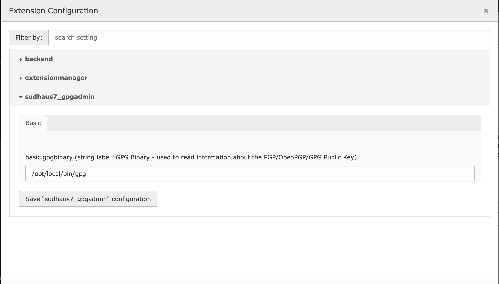

.. ==================================================
.. FOR YOUR INFORMATION
.. --------------------------------------------------
.. -*- coding: utf-8 -*- with BOM.

.. include:: ../Includes.txt

.. _configuration:

Installation and Configuration
==============================

.. _installation:

Installation
^^^^^^^^^^^^

This extension can either be installed via composer:

``composer req sudhaus7/sudhaus7-gpgadmin``

or via the TER (https://extensions.typo3.org/extension/sudhaus7_gpgadmin/)

.. _configure_the_extension

Configuration
^^^^^^^^^^^^^

Without any further setting the extension will look for the gpg keyring in the directory `$HOME/.gnupg/`, where $HOME is the home directory of the user PHP runs under. That might be the webserver user if it runs under apache, or the user the fpm-daemon runs as.

In the extension configuration this directory can be set to a different location. The directory has to exist and be writeable by the user php runs as, and it is recommended that this directory is NOT below $_SERVER['DOCUMENT_ROOT'], ie not accessible via the web.

Please set an absolute path for the keyring directory. You can add an existing keyring to this folder. If no keyring exists it will be created.

.. important::
   The keys you add to your keyring can NOT be password protected! There is no valid procedure to deal with password protected keys in ext-gnupg! It is recommended to only add public keys.

.. _adding_keys

Adding keys can be done with your favorite PGP/GPG management tool, or through the TYPO3 backend module `GnuPG Admin` by pressing the `add new key` button.

.. figure:: ../Images/module.png
   :alt: GnuPG Admin module

Simply copy&paste your public key into the field and press the `add new key` button.

.. important::
   You need to add the public key for each recipient you plan to send emails to in order for the email to be encrypted! If no public key can be found for the used recipient of the email, the email will not be sent!

.. info::
   If you want the email to be signed you have to add a key that is able to sign an email in the name of the sender(s) to the keyring. Signing is optional, the resulting email will be sent if it is signed or not.

.. figure:: ../Images/keyadded.png
   :alt: List with a key available

The information in the list of keys show how the key can be used. The column `Email` holds the definite Email for which this key can be used. If a key can not be used there will be additional information in the form of tags in the `Problems` column.

Possible tags are:

* [Expired] - the key is expired
* [Revoked] - the key is marked as revoked
* [Locked] - the key is password protected. You should be able to use this key for encryption, but not for signing.

Finally the button at the end of the row can be used to delete that key from the keyring.
