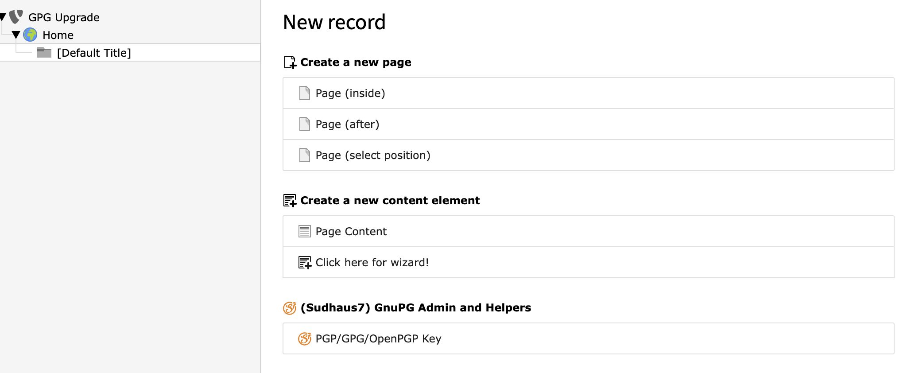

.. include:: /Includes.rst.txt

.. _configuration:

Installation and Configuration
==============================

.. _installation:

Installation
^^^^^^^^^^^^

This extension can either be installed via composer:

``composer req sudhaus7/sudhaus7-gpgadmin``

or via the TER (https://extensions.typo3.org/extension/sudhaus7_gpgadmin/)

.. _configuretheextension:

Configuration
^^^^^^^^^^^^^

If there is no ext-gnupg (https://www.php.net/manual/en/book.gnupg.php) extension installed in your version of PHP, you need the CLI version of GPG or OpenPGP. Enter the path to this binary in the Extension setup like shown below

.. figure:: ../Images/extensionsetup.png
   :alt: Extension settings

.. important::
   in order to use the gpg binary, the functions popen and proc_open need to be enabled for your PHP installation.

.. _addingkeys:

Adding keys are simply be done by creating an PGP/GPG/OpenPGP Key Record in a Sysfolder of your choice.

Simply enter your e-mail address and copy&paste your public key into the field. After saving below the field with the key information about its validity should be visible

.. figure:: ../Images/addkey.png
   :alt: Add a new key

.. important::
   You need to add the public key for each recipient you plan to send emails to in order for the email to be encrypted! If no public key can be found for the used recipient of the email, the email will not be sent!

