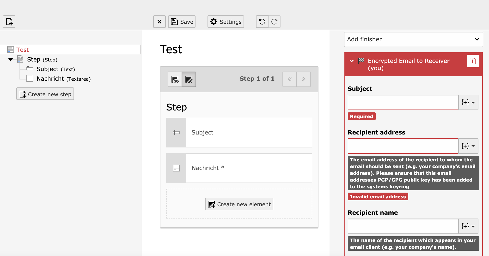

.. include:: /Includes.rst.txt

.. _editors:

Using the EXT:form finisher
===========================

When you edit a form you will now have a finisher available called `Encrypted Mail to Receiver (you)` which is a drop-in replacement for the `Mail to Receiver (you)` finisher you would normally use.

This finisher has the same configuration options and possibilities as its cousin, and it is used identically.

.. note::
   It does not make sense to make a pgp/gpg variation available for the `Email to Sender` finisher, as we likely do not have the submitters' public key available. A future version might add a finisher to just sign this type of email.

.. note::
   Multiple recipients are supported, but based on most email clients, only the recipients in the To: field are encrypted. However, Cc or Bcc can still be used, for example as a backup, and will also receive an encrypted version of the email.

.. important::
   Please take care that you have added the recipients public key to your :ref:`keyring <addingkeys>`
